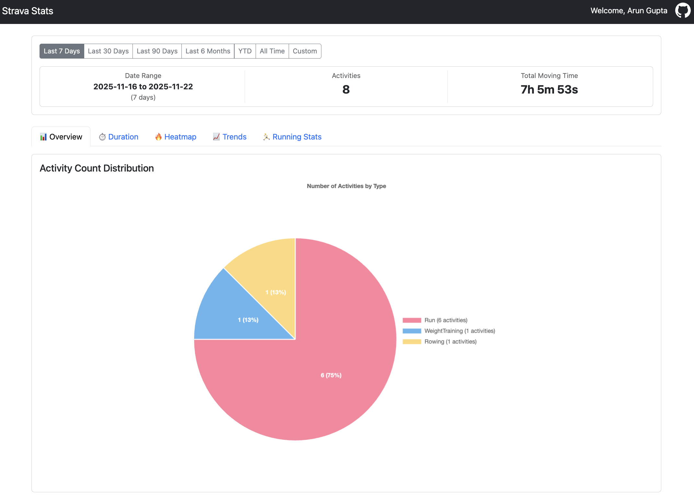
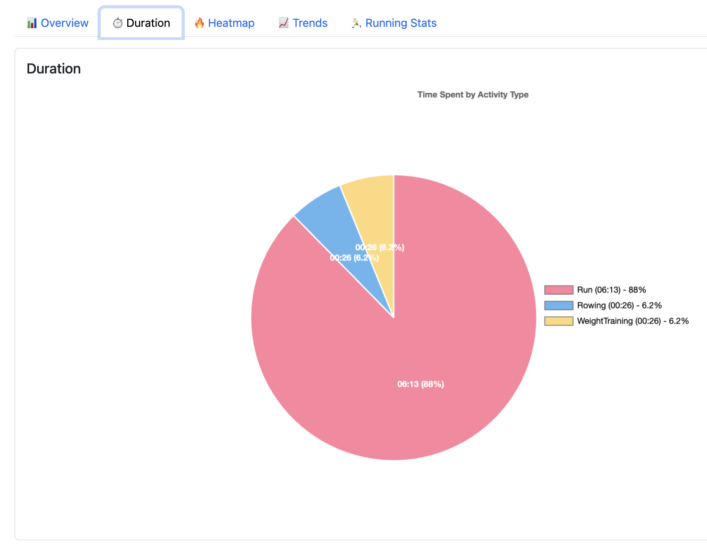
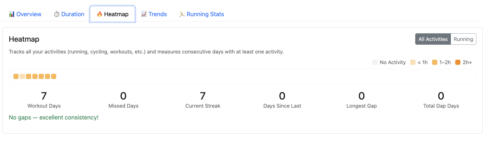
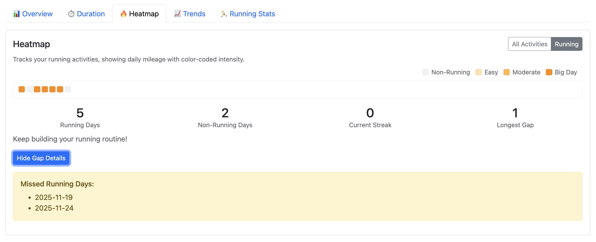
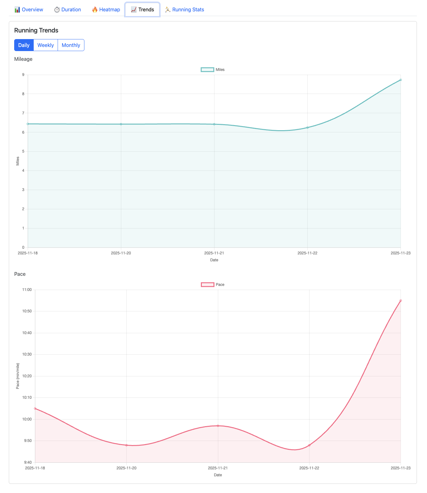

# Strava Activity Analyzer (Java)

A Spring Boot application for analyzing Strava activities with comprehensive statistics and visualizations.

## Features

### Analytics & Visualizations
- **Overview** - Pie chart showing activity types with counts and percentages
- **Duration** - Visualize time spent per activity type in HH:MM format
- **Heatmap** - Toggle between:
  - **All Activities**: grid heatmap of any-activity days with streak counters and gap details
  - **Running**: calendar-like daily mileage heatmap with running streak counters
- **Trends** - Daily/Weekly/Monthly charts with smooth curves for:
  - Running mileage with tooltips
  - Average pace in MM:SS format
- **Running Stats** - Comprehensive running metrics including:
  - Total runs and 10K+ runs count
  - Total miles and average pace
  - Run distance distribution histogram (0-10 miles in 1-mile ranges)
  - Personal records (fastest mile, fastest 10K, longest run, most elevation)
- **Date Range Filtering** - Quick pick buttons (7 days, 30 days, 90 days, 6 months, 1 year, YTD, All Time) and custom date range selection

### Security & Reliability
- **Secure OAuth Authentication** - Spring Security OAuth2 integration with Strava
- **Comprehensive Error Handling** - User-friendly error messages with automatic retry for transient failures
- **Resilience Patterns** - Circuit breaker and exponential backoff retry for API reliability
- **Input Validation** - Server-side validation for all user inputs

## Quickstart

1. **Create a Strava API application**
   - Go to https://www.strava.com/settings/api
   - Create application with callback domain: `localhost`
   - Note your Client ID and Client Secret

2. **Configure credentials**
   ```bash
   cp src/main/resources/application.properties src/main/resources/application-local.properties
   # Edit application-local.properties and add your credentials
   ```

3. **Run** (opens http://localhost:8080 automatically)
   ```bash
   ./quickstart.sh
   ```

4. **Connect with Strava and start analyzing!**

> Requires Java 21. See [SETUP.md](SETUP.md) for detailed instructions.

## Screenshots

Click on any thumbnail to view the full image:

<table>
  <tr>
    <td align="center" width="33%">
      <strong>Overview</strong><br>
      <a href="docs/images/overview.png"></a>
    </td>
    <td align="center" width="33%">
      <strong>Duration</strong><br>
      <a href="docs/images/duration.png"></a>
    </td>
    <td align="center" width="33%">
      <strong>Heatmap - All Activities</strong><br>
      <a href="docs/images/heatmap-all.png"></a>
    </td>
  </tr>
  <tr>
    <td align="center" width="33%">
      <strong>Heatmap - Running</strong><br>
      <a href="docs/images/heatmap-running.png"></a>
    </td>
    <td align="center" width="33%">
      <strong>Trends</strong><br>
      <a href="docs/images/trends.png"></a>
    </td>
    <td align="center" width="33%">
      <strong>Running Stats</strong><br>
      <a href="docs/images/running-stats.png"></a>
    </td>
  </tr>
</table>

## Documentation

For detailed setup instructions, configuration options, API documentation, and troubleshooting, see [SETUP.md](SETUP.md).

To recreate this application in any language or stack, see the language-agnostic [requirements.md](docs/requirements.md).

## Technology Stack

- **Spring Boot 3.5.7** - Application framework
- **Spring Security OAuth2 Client** - Strava OAuth authentication
- **Spring WebFlux** - Reactive HTTP client for Strava API
- **Thymeleaf** - Server-side templating
- **Bootstrap 5** - UI framework
- **Chart.js** - Data visualization
- **Lombok** - Reduce boilerplate code