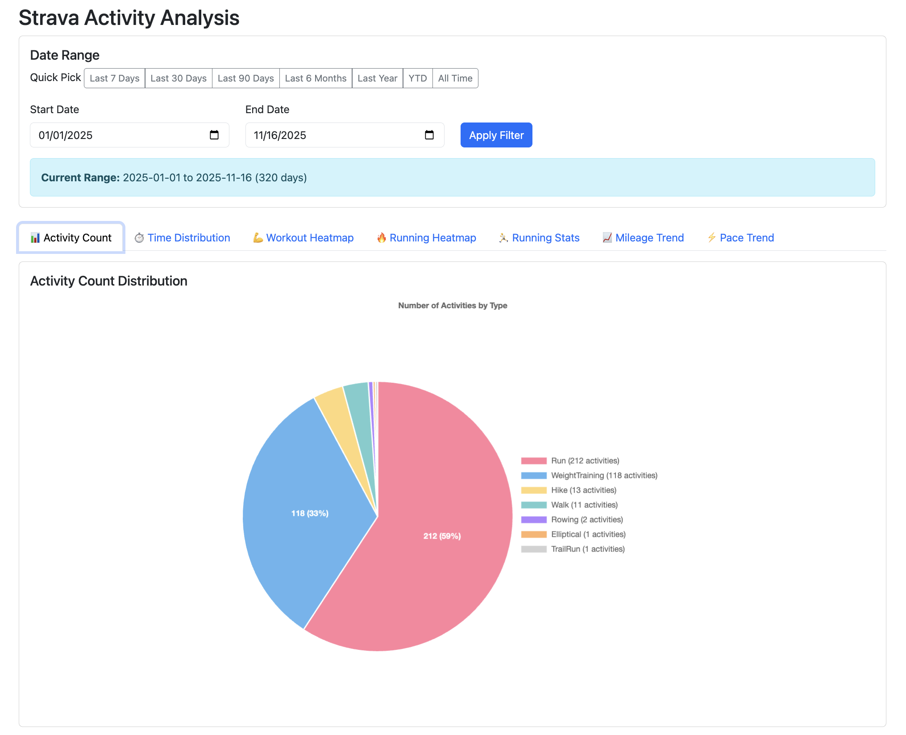
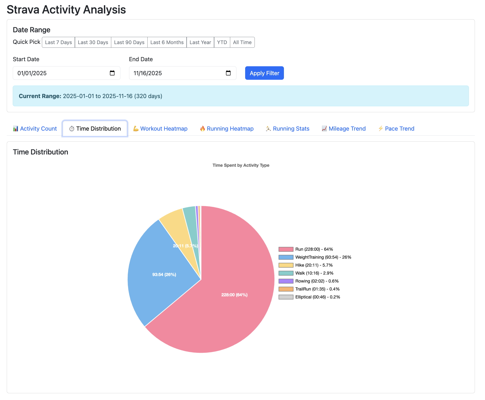
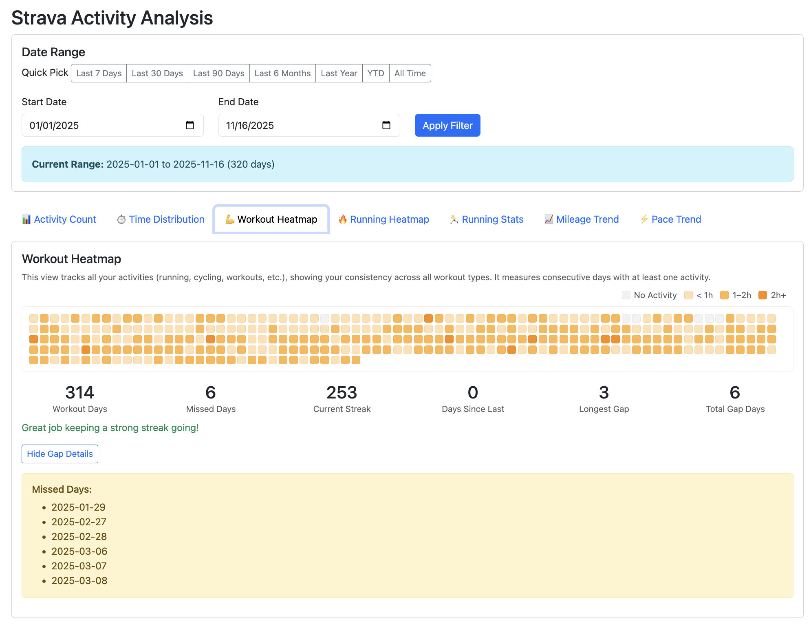
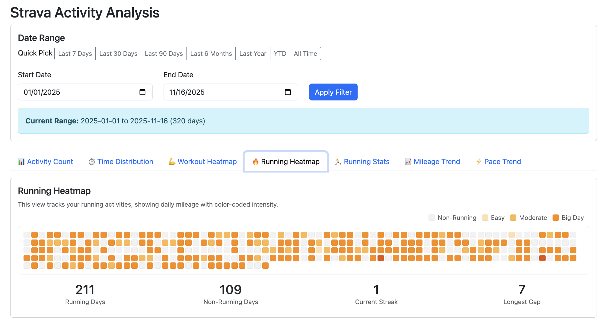
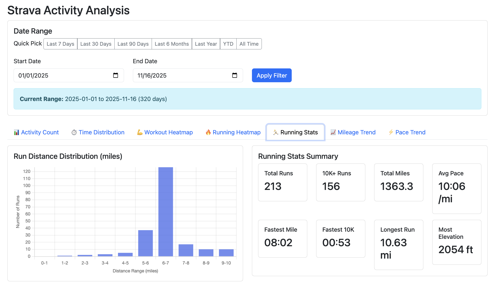
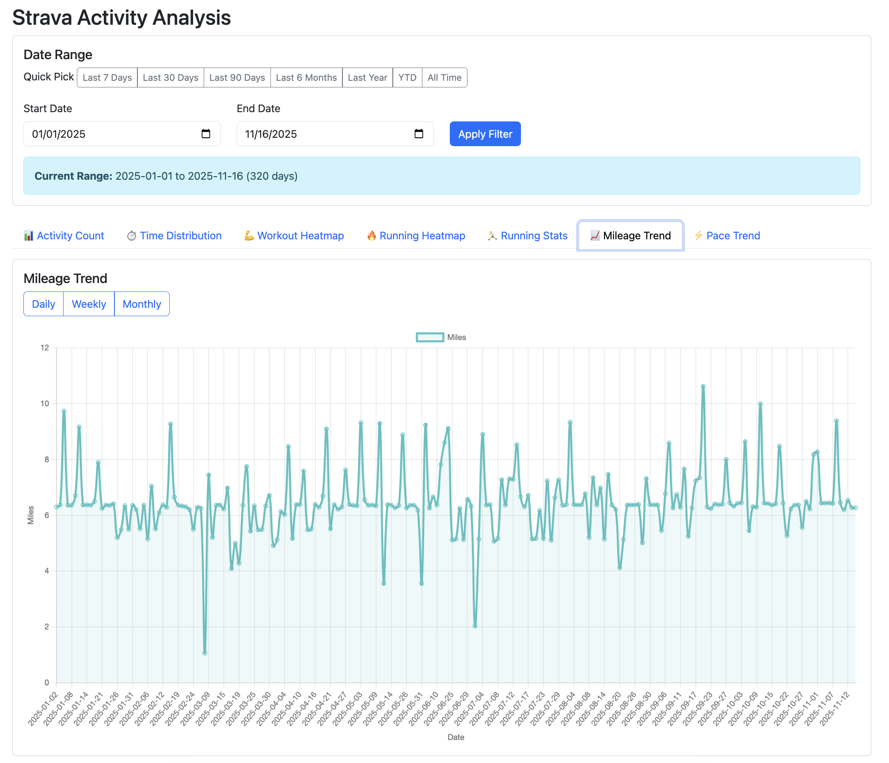
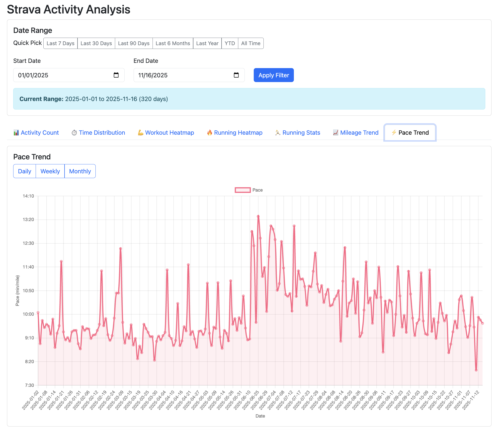

# Strava Activity Analyzer

A Spring Boot application for analyzing Strava activities with comprehensive statistics and visualizations.

## Quickstart

Get up and running in 5 minutes:

1. **Create a Strava API application**
   - Go to https://www.strava.com/settings/api
   - Create a new application with callback domain: `localhost`
   - Note your Client ID and Client Secret

2. **Set up credentials**
   ```bash
   export STRAVA_CLIENT_ID=your-client-id
   export STRAVA_CLIENT_SECRET=your-client-secret
   ```

3. **Run the application**
   ```bash
   ./gradlew bootRun
   ```

4. **Access the dashboard**
   - Open http://localhost:8080
   - Click "Connect with Strava"
   - Authorize the application
   - Start analyzing your activities!

> **Note:** Requires Java 21. See [Prerequisites](#prerequisites) for installation instructions.

## Features

- **Secure Strava OAuth Authentication** - Login with your Strava account
- **Activity Count Distribution** - Pie chart showing activity types with counts and percentages
- **Time Distribution** - Visualize time spent per activity type in HH:MM format
- **Workout Heatmap** - Grid-based heatmap tracking all activities with intensity coloration and streak statistics
- **Running Heatmap** - Grid-based calendar view with color-coded daily mileage intensity and running streak statistics
- **Running Stats** - Comprehensive running metrics including:
  - Total runs and 10K+ runs count
  - Total miles and average pace
  - Run distance distribution histogram (0-10 miles in 1-mile ranges)
  - Personal records (fastest mile, fastest 10K, longest run, most elevation)
- **Mileage Trend** - Daily/Weekly/Monthly running mileage charts with smooth curves and tooltips
- **Pace Trend** - Daily/Weekly/Monthly average pace displayed in MM:SS format
- **Date Range Filtering** - Quick pick buttons (7 days, 30 days, 90 days, 6 months, 1 year, YTD, All Time) and custom date range selection

## Screenshots

Click on any thumbnail to view the full image:

### Activity Count
[](docs/images/activity-count.png)

### Time Distribution
[](docs/images/time-distribution.png)

### Workout Heatmap
[](docs/images/workout-heatmap.png)

### Running Heatmap
[](docs/images/running-heatmap.png)

### Running Stats
[](docs/images/running-stats.png)

### Mileage Trend
[](docs/images/mileage-trend.png)

### Pace Trend
[](docs/images/pace-trend.png)

## Documentation

For detailed setup instructions, configuration options, API documentation, and troubleshooting, see [SETUP.md](SETUP.md).

## Technology Stack

- **Spring Boot 3.5.7** - Application framework
- **Spring Security OAuth2 Client** - Strava OAuth authentication
- **Spring WebFlux** - Reactive HTTP client for Strava API
- **Thymeleaf** - Server-side templating
- **Bootstrap 5** - UI framework
- **Chart.js** - Data visualization
- **Lombok** - Reduce boilerplate code